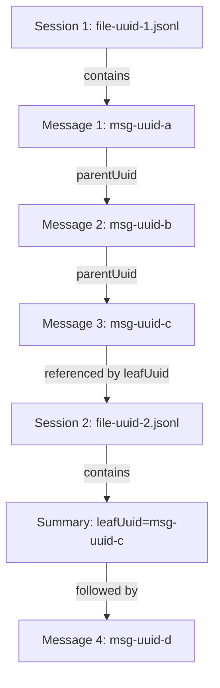

# Claude Code File Relationships and Conversation Types

## Overview

Claude Code manages complex relationships between conversation files, supporting conversation continuations, parallel processing, and maintaining context across sessions. This document describes how files relate to each other and the different types of conversations that exist.

## Conversation Types

### 1. Regular Conversations

**Characteristics:**
- Single JSONL file per conversation session
- Linear message flow with parent-child relationships
- No summary message at the beginning
- Complete, self-contained conversation threads
- File sizes typically 100KB-2MB

**Structure:**
```
Message 1 (parentUuid: null) → Message 2 → Message 3 → ... → Final Message
```

**Use Cases:**
- Standard development sessions
- Single-task focused work
- Short to medium-length interactions

**Observed Frequency:**
- Most common pattern in simple projects
- 100% of conversations in projects without continuations

### 2. Continuation Conversations

**Characteristics:**
- Begin with a summary message containing `leafUuid`
- Reference a previous conversation that reached context limits
- Maintain project and environmental context
- New session ID but continuing the same logical conversation

**Structure:**
```
Previous File: [...messages...] → Last Message (uuid: X)
                                            ↓
New File: Summary (leafUuid: X) → Continuation Messages...
```

**Identification:**
- First line contains `"type": "summary"`
- Summary includes brief description of previous conversation
- `leafUuid` points to the last significant message in the predecessor

**Example Flow:**
1. Original conversation reaches context limit
2. User starts new conversation with summary
3. New file created with summary as first entry
4. Conversation continues with fresh context

### 3. Sidechain Conversations

**Characteristics:**
- Marked with `"isSidechain": true`
- Parallel processing threads within same session
- Often used for sub-agent tasks via Task tool
- Share same `sessionId` as main conversation
- Often have `parentUuid: null` despite being sidechains

**Structure:**
```
Main Thread: Message A → Message B → Message C
                ↓           ↓
Sidechain 1: Task X     Sidechain 2: Task Y
```

**Use Cases:**
- Complex multi-step operations
- Parallel tool executions
- Sub-agent task delegation (architecture-reviewer, synthesis-master, etc.)
- Background processing

**Observed Frequency:**
- Simple projects often have no sidechains
- Moderate complexity projects may have some sidechain usage
- Complex projects can show significant sidechain usage (up to 50% or more of files)

### 4. Compact Summary Conversations

**Characteristics:**
- Messages marked with `"isCompactSummary": true`
- Highly condensed conversation representations
- Used for context preservation in continuations
- Contains essential information from previous sessions

### 5. Summary-Only Files

**Characteristics:**
- Files containing only a single summary message
- As small as 122 bytes
- Can indicate project completion (e.g., "GitHub Deployment Complete")
- Contains type, summary, and leafUuid only

**Example:**
```json
{"type":"summary","summary":"Project Deployment Complete","leafUuid":"xxxxxxxx-xxxx-xxxx-xxxx-xxxxxxxxxxxx"}
```

**Use Cases:**
- Project completion markers
- Clean termination points
- Minimal continuation references

## UUID Relationship System

### Primary Identifiers

#### sessionId
- **Scope**: Entire conversation file
- **Format**: UUID v4
- **Usage**: File naming and session tracking
- **Uniqueness**: One per JSONL file
- **Example**: `30ea3608-ac58-4466-9f4f-417b13bb3644`

#### uuid
- **Scope**: Individual message
- **Format**: UUID v4
- **Usage**: Unique message identification
- **Uniqueness**: Globally unique per message
- **Relationship**: Referenced by `parentUuid` in child messages

#### parentUuid
- **Scope**: Message threading
- **Format**: UUID v4 or null
- **Usage**: Links messages in conversation flow
- **Rules**:
  - `null` for conversation start or root messages
  - References previous message's `uuid`
  - Creates directed acyclic graph of messages

#### leafUuid
- **Scope**: Conversation continuations
- **Format**: UUID v4
- **Usage**: Links continuation to previous conversation
- **Location**: Only in summary messages
- **Purpose**: Identifies endpoint of previous conversation

### Relationship Patterns



### How to Explore Relationships in Your System
```bash
# Find continuation conversations (files starting with summary)
for file in ~/.claude/projects/*/*.jsonl; do
  first_line=$(head -1 "$file" 2>/dev/null)
  if echo "$first_line" | jq -e '.type == "summary"' >/dev/null 2>&1; then
    echo "Continuation found: $(basename "$file")"
    echo "$first_line" | jq '.summary'
  fi
done

# Check for sidechains in your projects
grep -l '"isSidechain":true' ~/.claude/projects/*/*.jsonl 2>/dev/null

# Count files per project
for dir in ~/.claude/projects/*/; do
  count=$(ls "$dir"/*.jsonl 2>/dev/null | wc -l)
  if [ $count -gt 0 ]; then
    echo "$(basename "$dir"): $count files"
  fi
done
```

## File Creation and Rollover Mechanisms

### Triggers for New File Creation

#### 1. New Conversation Session
- User initiates new chat
- Fresh context required
- No relationship to previous conversations

#### 2. Context Limit Reached
- Previous conversation exhausted token limits
- Continuation needed with summary
- Preserves logical conversation flow

#### 3. Project Context Switch
- Change in working directory
- Switch to different project
- Maintains project isolation

#### 4. Git Branch Change
- Switching branches triggers new context
- Prevents cross-branch contamination
- Maintains branch-specific history

#### 5. Time-Based Separation
- Long gaps between interactions
- Session timeout (appears to be hours/days)
- Natural conversation boundaries

#### 6. SDK/Automation Retry
- Same task attempted again
- New conversation file per attempt
- Can result in many files for same issue (up to 48 observed)

### Rollover Process

```
1. Detect trigger condition (context limit, timeout, etc.)
2. Generate summary of current conversation
3. Store leafUuid reference to last message
4. Create new JSONL file with new sessionId
5. Write summary as first entry in new file
6. Continue conversation with fresh context
```

## Cross-Directory Relationships

### Project Files ↔ Todo Files

**Relationship**: One-to-one mapping
- Each conversation session can have associated todo tracking
- Todo file named: `{sessionId}-agent-{agentId}.json`
- Tracks task progress throughout conversation

**Data Flow**:
```
projects/{project}/{session}.jsonl
    ↓
todos/{session}-agent-{agent}.json
```

### Project Files ↔ Shell Snapshots

**Relationship**: Many-to-many
- Shell snapshots capture environment state
- Multiple conversations can reference same snapshot
- Snapshots persist across sessions

**Use Cases**:
- Environment debugging
- State restoration
- Configuration tracking

### Project Files ↔ IDE Lock Files

**Relationship**: Process-based
- Lock files prevent concurrent access
- Not directly tied to specific conversations
- Process ID based naming

## Conversation Lifecycle

### 1. Initialization Phase
```
User starts conversation
    ↓
Create new JSONL file (UUID named)
    ↓
First message (parentUuid: null)
    ↓
Record session context (cwd, branch, version)
```

### 2. Active Phase
```
User input → Assistant response → Tool execution → Results
    ↓                ↓                ↓              ↓
Each step creates new message with parentUuid chain
```

### 3. Continuation Phase (if needed)
```
Context limit approached
    ↓
Generate conversation summary
    ↓
Create new file with summary
    ↓
Continue with leafUuid reference
```

### 4. Completion Phase
```
Natural conversation end
    ↓
Final messages written
    ↓
File closed (no explicit termination marker)
```

## Message Threading Patterns

### Linear Threading
Most common pattern - simple request/response:
```
User → Assistant → User → Assistant
```

### Tool Execution Threading
Complex pattern with tool interactions:
```
User Request
    ↓
Assistant (with tool_use)
    ↓
User (with tool_result)
    ↓
Assistant (continuation with more tools)
    ↓
User (with multiple tool_results)
    ↓
Assistant (final response)
```

### Sidechain Threading
Parallel execution pattern:
```
Main: User Request
         ↓
Main: Assistant (spawns sidechain)
         ↓
     [Sidechain: Independent thread]
         ↓
Main: Assistant (incorporates results)
```

## Data Integrity and Recovery

### UUID Chain Validation
- Each message's `parentUuid` must reference existing `uuid`
- Broken chains indicate corruption or missing data
- Can rebuild conversation flow from UUID relationships

### Timestamp Ordering
- Messages include ISO 8601 timestamps
- Enables chronological reconstruction
- Handles clock skew and timezone differences

### Session Context Preservation
- Every message includes full context
- Working directory tracked per message
- Git branch information maintained
- Enables accurate replay and debugging

## Best Practices for Archiving

### Complete Conversation Capture
1. Include all files with same `sessionId`
2. Follow `leafUuid` references for continuations
3. Include related todo files if present
4. Preserve timestamp information

### Relationship Preservation
1. Maintain UUID integrity
2. Keep parent-child relationships intact
3. Preserve sidechain markers
4. Include summary messages

### Context Reconstruction
1. Use timestamps for ordering
2. Follow UUID chains for threading
3. Respect sidechain boundaries
4. Maintain session isolation

## Archive Utility Considerations

### Essential Data to Preserve
- All messages in conversation chain
- UUID relationships
- Timestamps and context
- Tool results and outputs

### Optional Data to Include
- Todo tracking files
- Shell snapshots
- Related sidechain conversations
- Previous conversations in continuation chain

### Data to Sanitize
- API keys and tokens
- Personal access tokens
- Sensitive environment variables
- Private credentials

## Conversation Type Detection

### Heuristics for Classification

#### Regular Conversation
```python
def is_regular_conversation(messages):
    first_msg = messages[0]
    return (
        first_msg.get("type") != "summary" and
        first_msg.get("parentUuid") is None and
        not first_msg.get("isCompactSummary")
    )
```

#### Continuation Conversation
```python
def is_continuation(messages):
    first_msg = messages[0]
    return (
        first_msg.get("type") == "summary" and
        len(messages) > 1  # Not a summary-only file
    )
```

#### Summary-Only File
```python
def is_summary_only(messages):
    return (
        len(messages) == 1 and
        messages[0].get("type") == "summary"
    )
```

#### Sidechain Detection
```python
def has_sidechains(messages):
    return any(msg.get("isSidechain") for msg in messages)
```

#### Complex Project Detection
```python
def is_complex_project(project_files):
    sidechain_ratio = sum(1 for f in project_files if has_sidechains(f)) / len(project_files)
    has_task_tool = any("Task" in f for f in project_files)
    return sidechain_ratio > 0.3 or has_task_tool
```

## Performance Implications

### File Size Considerations
- No built-in size limits observed
- Files can grow to 10+ MB
- Large files may impact parsing performance
- Consider streaming for large conversations

### Relationship Traversal
- UUID lookups should use indexing
- Build parent-child maps for efficiency
- Cache continuation chains
- Optimize sidechain detection